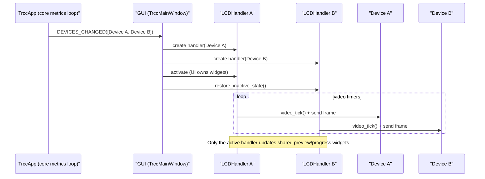

# Multi-Display (Multiple LCD Devices)

TRCC Linux can connect to multiple compatible LCD devices at the same time.
Each connected LCD has its own render pipeline (`Device` → `DisplayService`),
and the GUI creates one `LCDHandler` per LCD.

## What Works

- Multiple LCDs show up in the GUI device sidebar.
- You can switch which LCD is *active* (the one shown in the preview/settings panels).
- Inactive LCDs keep their physical display updated (including video playback).

## Important Detail: Shared GUI Widgets

The GUI uses a single set of preview/settings widgets for the *active* device.
Inactive devices must **not** update those widgets, but they still need to keep
their own video timer running to pump frames to hardware.

## CLI Targeting

Most LCD commands accept `--device/-d` to target a specific device.

- Use a device path: `trcc send -d /dev/sg2 image.png`
- Or use the 1-based device number from `trcc detect --all`: `trcc send -d 2 image.png`

## Known Limitations

- Slideshow/carousel timers are tied to the active device UI state. When you switch
  away from an LCD, its slideshow is paused. Video playback continues.

